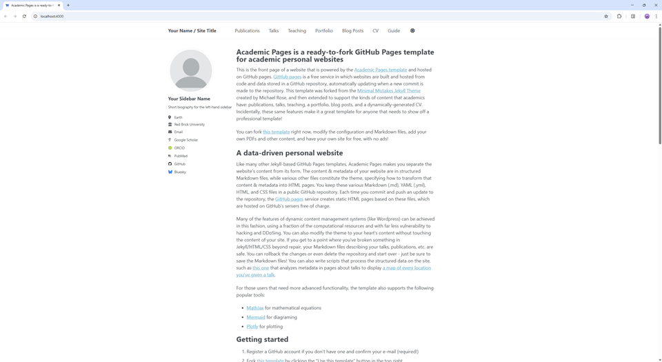

# Yongxin Su — Personal Website

Personal academic website built with Academic Pages, hosted at https://syx7777.github.io.

## 日常修改

- `_config.yml`：姓名、邮箱、单位、侧栏简介和网站地址。
- `_pages/home.md`：首页介绍、研究方向和教育经历。
- `_pages/cv.md`：简历。
- `_data/navigation.yml`：顶部导航。
- `images/profile.webp`：头像。

## 添加项目

1. 将 `_drafts/project-template.md` 复制为 `_portfolio/your-project.md`。
2. 填写 `title`、`date`、`excerpt` 和正文，将 `permalink` 改为唯一地址，例如 `/project/your-project/`。
3. 将 `published: false` 改为 `published: true`，并填写真实的代码仓库链接。
4. 可将配图放入 `images/`，在正文中用 `` 引用。
5. 提交并推送后，项目会自动出现在首页、Projects 页面和 CV 中，按日期倒序排列。

首页和 Projects 页面共用 `_includes/projects-list.html`，不用手动维护两份项目列表。

## 发布

在 PowerShell 7 中进入仓库后执行：

```powershell
chcp 65001 > $null
git add _config.yml _data/navigation.yml _pages/home.md _pages/cv.md _pages/portfolio.html _includes/projects-list.html _portfolio _drafts/project-template.md README.md images/profile.webp
git commit -m "Personalize homepage and prepare project portfolio"
git push origin master
```

GitHub Pages 使用 `master` 分支和根目录。可在仓库 Actions 中查看发布结果。

## 暂不展示的内容

论文、报告、教学、博客和模板指南已在 `_config.yml` 中排除，原始模板文件保留供以后参考。
以后需要论文页面时，移除 `_publications` 与 `_pages/publications.html` 的排除项，将 `collections.publications.output` 改为 `true`，先删除或替换示例论文，再添加导航。

---

以下保留 Academic Pages 原始说明与署名。

# Academic Pages
**Academic Pages is a GitHub Pages template for personal and professional portfolio-oriented websites.**



# Getting Started

1. Register a GitHub account if you don't have one and confirm your e-mail (required!)
1. Click the "Use this template" button in the top right.
1. On the "New repository" page, enter your public repository name as "[your GitHub username].github.io", which will also be your website's URL.
1. Edit site-wide configuration in `_config.yml` and double check that the `url` is the one that you just selected in the previous step and that `repository` reflects the correct path for your repository.
1. Add your site content, upload any files (like PDFs, .zip files, etc.) to the `files/` directory. They will appear at https://[your GitHub username].github.io/files/example.pdf.
1. Check status by going to the repository settings, in the "GitHub pages" section
1. (Optional) Use the Jupyter notebooks or python scripts in the `markdown_generator` folder to generate markdown files for publications and talks from a TSV file.

See more info at https://academicpages.github.io/

### Additional Tutorials

Additional tutorials for working with the Academic Pages template can be found at the following sites:
- https://jayrobwilliams.com/posts/2020/06/academic-website/

## Running locally

When you are initially working on your website, it is very useful to be able to preview the changes locally before pushing them to GitHub. To work locally you will need to:

1. Clone the repository and made updates as detailed above.

### Using a different IDE
1. Make sure you have ruby-dev, bundler, and nodejs installed
    
    On most Linux distributions and [Windows Subsystem Linux](https://learn.microsoft.com/en-us/windows/wsl/about) the command is:
    ```bash
    sudo apt install ruby-dev ruby-bundler nodejs
    ```
    If you see error `Unable to locate package ruby-bundler`, `Unable to locate package nodejs `, run the following:
    ```bash
    sudo apt update && sudo apt upgrade -y
    ```
    then try running `sudo apt install ruby-dev ruby-bundler nodejs` again.

    On MacOS the commands are:
    ```bash
    brew install ruby
    brew install node
    gem install bundler
    ```
1. Run `bundle install` to install ruby dependencies. If you get errors, delete Gemfile.lock and try again.

    If you see file permission error like `Fetching bundler-2.6.3.gem ERROR:  While executing gem (Gem::FilePermissionError) You don't have write permissions for the /var/lib/gems/3.2.0 directory.` or `Bundler::PermissionError: There was an error while trying to write to /usr/local/bin.`
    Install Gems Locally (Recommended):
    ```bash
    bundle config set --local path 'vendor/bundle'
    ```
    then try run `bundle install` again. If succeeded, you should see a folder called `vendor` and `.bundle`.

1. Run `jekyll serve -l -H localhost` to generate the HTML and serve it from `localhost:4000` the local server will automatically rebuild and refresh the pages on change to Markdown (*.md) and HTML files, while changes to the core template and configuration (i.e., `_config.yml`) will require stopping and restarting Jekyll.
    You may also try `bundle exec jekyll serve -l -H localhost` to ensure jekyll to use specific dependencies on your own local machine.

If you are running on Linux it may be necessary to install some additional dependencies prior to being able to run locally: `sudo apt install build-essential gcc make`

## Using Docker

Working from a different OS, or just want to avoid installing dependencies? You can use the provided `Dockerfile` to build a container that will run the site for you if you have [Docker](https://www.docker.com/) installed.

You can build and execute the container by running the following command in the repository:

```bash
chmod -R 777 .
docker compose up
```

You should now be able to access the website from `localhost:4000`.

### Using the DevContainer in VS Code

If you are using [Visual Studio Code](https://code.visualstudio.com/) you can use the [Dev Container](https://code.visualstudio.com/docs/devcontainers/containers) that comes with this Repository. Normally VS Code detects that a development container configuration is available and asks you if you want to use the container. If this doesn't happen you can manually start the container by **F1->DevContainer: Reopen in Container**. This restarts your VS Code in the container and automatically hosts your academic page locally on http://localhost:4000. All changes will be updated live to that page after a few seconds.

# Maintenance

Bug reports and feature requests to the template should be [submitted via GitHub](https://github.com/academicpages/academicpages.github.io/issues/new/choose). For questions concerning how to style the template, please feel free to start a [new discussion on GitHub](https://github.com/academicpages/academicpages.github.io/discussions).

This repository was forked (then detached) by [Stuart Geiger](https://github.com/staeiou) from the [Minimal Mistakes Jekyll Theme](https://mmistakes.github.io/minimal-mistakes/), which is © 2016 Michael Rose and released under the MIT License (see LICENSE.md). It is currently being maintained by [Robert Zupko](https://github.com/rjzupkoii), and additional maintainers would be welcome.

## Bugfixes and enhancements

If you have bugfixes and enhancements that you would like to submit as a pull request, you will need to [fork](https://docs.github.com/en/pull-requests/collaborating-with-pull-requests/working-with-forks/fork-a-repo) this repository as opposed to using it as a template. This will also allow you to [synchronize your copy](https://docs.github.com/en/pull-requests/collaborating-with-pull-requests/working-with-forks/syncing-a-fork) of the template to your fork as well.

Unfortunately, one logistical issue with a template theme like Academic Pages that makes it a little tricky to get bug fixes and updates to the core theme. If you use this template and customize it, you will probably get merge conflicts if you attempt to synchronize, although [rebasing](https://git-scm.com/docs/git-rebase) the changes from this template will work along with manually [cherry picking](https://git-scm.com/docs/git-cherry-pick) the relevant commits. If you are not comfortable with the Git command line, you can save your various `.yml` configuration files and Markdown files, delete the repository, and fork it again. 

---
<div align="center">
    

[](https://github.com/academicpages/academicpages.github.io/graphs/contributors)
[](https://github.com/academicpages/academicpages.github.io/releases/latest)
[](https://github.com/academicpages/academicpages.github.io/blob/master/LICENSE)

[](https://github.com/academicpages/academicpages.github.io)
[](https://github.com/academicpages/academicpages.github.io/fork)
</div>
